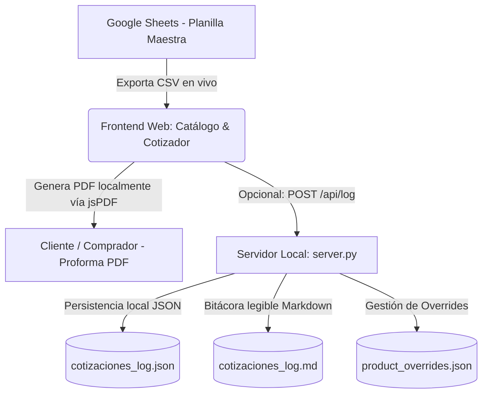
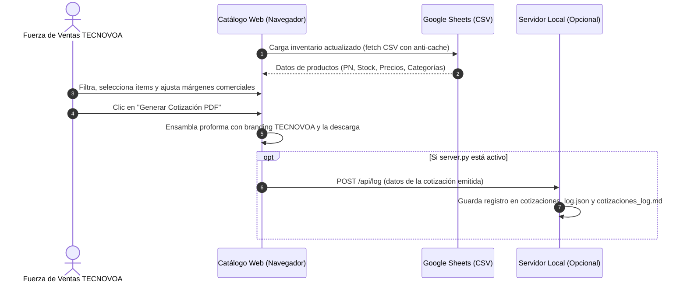

# 🏛️ Arquitectura del Sistema — TECNOVOA B2B

Este documento describe la arquitectura técnica, el flujo de datos y la operación del Catálogo B2B Privado y Cotizador Comercial exclusivo de **TECNOVOA**.

---

## 🗺️ Mapa General del Sistema

El sistema opera como una aplicación web ligera y autónoma, desacoplada de backends complejos, que consume el maestro de inventario directamente desde Google Sheets y genera cotizaciones en PDF en el navegador del cliente.

---

## 🛠️ Stack Tecnológico

1. **Frontend (Catálogo Web & Cotizador):**
   * **Core:** HTML5 Semántico y JavaScript Vanilla (ES6+ modular).
   * **Estilos:** Vanilla CSS moderno (Diseño oscuro premium, responsive con micro-interacciones).
   * **Generación de Documentos:** `jsPDF` y librerías client-side para proformas comerciales en PDF de alta fidelidad editorial.
   * **Diseñador de Flyers:** HTML5 Canvas para generación dinámica de piezas promocionales de productos individuales.

2. **Capa de Datos:**
   * **Maestro de Productos:** Google Sheets publicado en la web como CSV (`Hoja 2` / `CATALOGO`), permitiendo actualización en tiempo real sin redespliegues.
   * **Overrides de Producto:** Almacenamiento local JSON (`catalogo/data/product_overrides.json`) para ajustar márgenes, fotos o disponibilidad sin alterar la planilla maestra.

3. **Backend Local de Utilidades (`server.py`):**
   * Servidor HTTP nativo en Python (`http.server`) sin dependencias externas pesadas.
   * Endpoints REST para captura de logs locales (`/api/log`) y gestión de personalizaciones (`/api/product-overrides`, `/api/update-product`).

> [!NOTE]
> La conexión con Obsidian fue una herramienta de diseño y prototipado temprano del desarrollador. En producción y en esta versión el proyecto funciona de manera 100% independiente y autónoma.

---

## 🔄 Flujo de Emisión de una Cotización

---

## 📁 Estructura del Repositorio

* **`catalogo/`**: Directorio raíz de la aplicación web estática.
  * `index.html`: Aplicación principal del catálogo y cotizador.
  * `css/`: Estilos modernos y temas visuales (`style.css`).
  * `js/`: Lógica client-side del catálogo, cálculo de márgenes y PDF (`app.js`).
  * `data/`: Overrides locales de productos.
* **`server.py`**: Servidor local ligero en Python para desarrollo y registro local de logs.
* **`INSTRUCTIVO_DATOS_SHEETS.md`**: Guía operativa para el mantenimiento de la planilla de productos.
* **`DESIGN.md`**: Lineamientos de experiencia de usuario, interfaz visual y diseño editorial.
