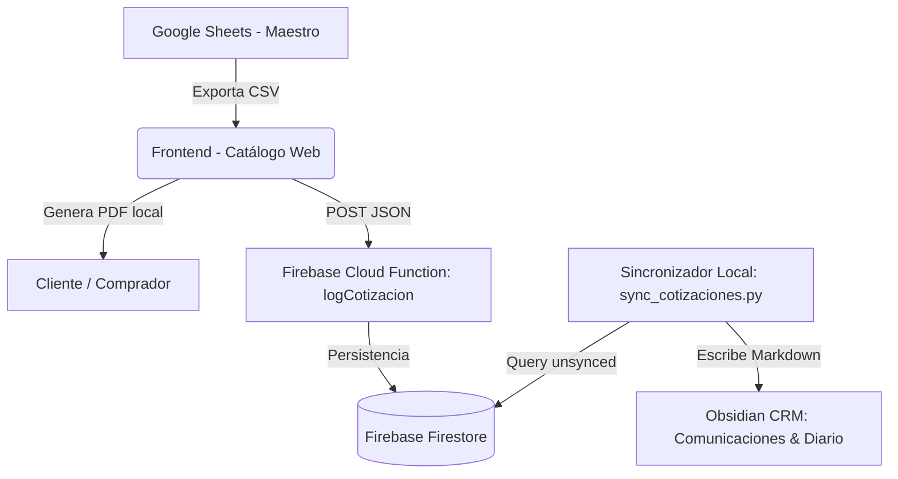
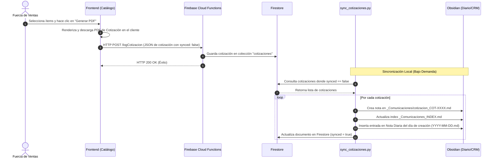

# 🏛️ Arquitectura del Sistema — TECNOVOA B2B

Este documento describe la arquitectura de software, el flujo de datos y la integración de sistemas para el Catálogo B2B Privado y Cotizador de TECNOVOA.

---

## 🗺️ Mapa General del Sistema

El sistema utiliza una arquitectura híbrida: una aplicación web estática (desplegada en la nube) y un motor de sincronización local (que interactúa directamente con el vault de Obsidian como CRM).



---

## 🛠️ Stack Tecnológico

1. **Frontend (Catálogo Web):**

   * **Core:** Vanilla HTML5 y JavaScript (ES6+).
   * **Estilos:** Vanilla CSS (Diseño oscuro, responsive e interactivo).
   * **Librerías:** `jsPDF` para generación de proformas comerciales en PDF client-side.
   * **Hosting:** Firebase Hosting (Dominio: `cotizador-tecnovoa.web.app`).
2. **Backend Nube:**

   * **Cloud Functions (Node.js):** Endpoint `logCotizacion` que recibe y valida los metadatos de las cotizaciones emitidas.
   * **Base de Datos (Firestore):** Colección `cotizaciones` para almacenar el histórico y marcar el estado de sincronización (`synced: false`).
3. **Integración Local (CRM Obsidian):**

   * **Script de Sincronización:** [sync_cotizaciones.py](file:///c:/Users/Cristian/Obsidian/Cristian/CDU/PROYECTOS/TECNOVOA/cotizador/sync_cotizaciones.py) en Python.
   * **Servidor Local de Utilidades:** [server.py](file:///c:/Users/Cristian/Obsidian/Cristian/CDU/PROYECTOS/TECNOVOA/cotizador/server.py).
   * **Almacenamiento de Conocimiento:** Vault de Obsidian (CRM de Clientes, Personas y Comunicaciones).

---

## 🔄 Flujo de Datos de una Cotización

El siguiente diagrama detalla la secuencia de operaciones desde que el comercial/cliente interactúa con la interfaz hasta que la cotización se consolida en las notas de Obsidian.



---

## 📁 Vinculación de Obsidian (CRM y Notas Diarias)

El script [server.py](file:///c:/Users/Cristian/Obsidian/Cristian/CDU/PROYECTOS/TECNOVOA/cotizador/server.py) formatea e inyecta las cotizaciones utilizando la estructura de enlaces internos de Obsidian (Wikilinks).

1. **Nota de Comunicación:** Se genera en `_Comunicaciones/cotizacion_COT-XXXX.md` con un frontmatter completo:
   ```yaml
   fecha: "YYYY-MM-DD"
   tipo: cotizacion
   cliente: "Nombre Cliente"
   monto_neto_usd: X.XX
   estado: "emitida"
   ```
2. **Nota Diaria:** Inserta un bullet de seguimiento dentro de la sección `### Cotizaciones` en `04_Diario_y_Agenda/00_DIARIO/YYYY-MM-DD.md`:
   ` - 📄 [[_Comunicaciones/cotizacion_COT-XXXX|COT-XXXX]] — Cliente — USD$ X.XX — Margen X% — emitida`
3. **Índice de Comunicaciones:** Agrega de forma incremental la fila correspondiente en `_Comunicaciones/_Comunicaciones_INDEX.md` para un acceso rápido.
